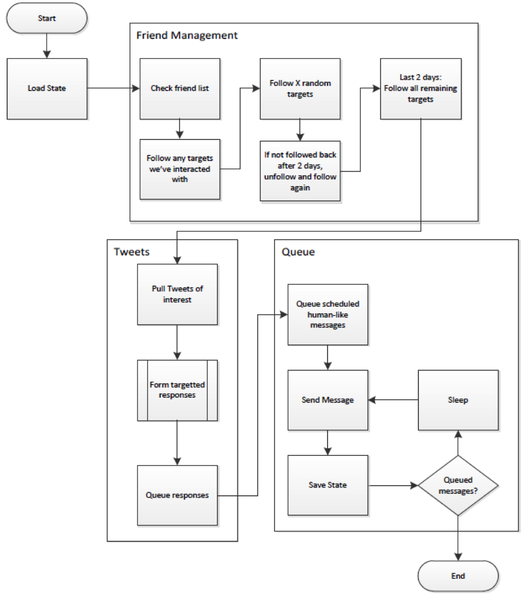

TwitterBot
==========

<h2>Abstract</h2>

A bot is an automated software program that can execute certain commands when it receives a specific input. A socialbot is a bot that spreads through social networking sites through a human behavioral archetype that resembles that of a real user.

The competition for this project involved each group of students fielding a Twitter socialbot that would do something interesting and relevant to social and computational intelligence - the team with the highest amount of followers or mentions was the winner. This competition made students better Pythonistas and gave us more familiarity with third party APIs.
  

Specific Twitter user accounts called “target users” were provided by our Professor, with the challenge being to effectively interact with them. Each team deployed one socialbot that could directly interact with the target users. Our bot happened to focus on movies and tweet about things relevant to our target users.

An error encountered during the following process led to an extreme acceleration in the pace of our following, resulting in the suspension of our bot account and the loss of approximately 24 hours of experiment time. Our bot generated a total of 91 status updates over the course of approximately six total days of uptime. The status updates included 24 retweets of updates posted by users in the experiment group and 27 mentions of users in the experiment group through “canned” tweets, resulting in four user replies and one user mention.

<h2>Background</h2>

Twitter provides two Application Programming Interfaces (API.) The Twitter Representational State Transfer (REST) API methods allow developers to access core Twitter data; this includes timelines, status data, and user information. The Search API methods give developers methods to interact with Twitter Search and trends data. The API supports the following data formats: XML, JSON, and RSS.

The language that was used to interface with Twitter API is Python. Python is an interpreted, object-oriented, high-level 
programming language with dynamic semantics. The Python implementation is under an open source license that makes it freely usable and distributable, even for commercial use. It provides high-level built in data structures, combined with dynamic typing and dynamic binding, which make it attractive for Rapid Application Development (RAD), as well as for use as a scripting to connect existing components together. Also, Python supports modules and packages, which encourages program modularity and code reuse.

<h2>Approach</h2>

Before knowing the targets, we created our Twitter bot account using a separate email account so that our team can access it and monitor notifications or request. Once we figured out the targets, we were able to focus on the questions and extrapolate answers. Our strategy was to focus on setting up our bot profile; for example, the profile picture and bio which will make it like a legitimate user. We also created a Klout account to check our social network popularity. Later, we created a script that went through the 500 targets that were provided by Professor McCarty and find the targets that had over 1000 followers, then we looked at the top 20 users that fit that criteria and watched their tweeting behavior. We read through their tweets and saw what each user liked to tweet about. Based on what those users’ tweet, we created a canned tweet messages that @replies to a specific user with a message that pertained to their interests. For example, we looked at the tweets for user “@User1” and put this message in our canned update file: 

(status = '@User1 What is the job market like in Boulder? My grandson might move there')

Below is the list of external resources that we used to provide accurate information in our tweets:

<ul>
<li>Feedparser</li>
<li>Google search API</li>
<li>Rottentomatoes API</li>
<li>bit.ly</li>
<li>Yahoo RSS Feeds - Movies, News</li>
<li>Yahoo Search</li>
<li>Google News</li>
</ul>

Figure 1, below, shows the workflows for our bot’s processes, including “friend management”, “tweet processing”, and “outbound queue processing”.

<h2>Results</h2>

We deployed our bot at 8:30am. The half-hour delay was spent on communicating among all group members to make sure everyone in our team was ready and all the modifications were recorded properly. We categorized our results based on quantitative and qualitative data which is described below in detail:

<ul>
<li>Quantitative results:</li>
<ul>
<li>Followers: 24 followers, 21 from the target group</li>
<li>Replies: 4</li>
<li>Mentions: 1</li>
<li>Suspension: 1</li>
<li>Number of friends: 484</li>
<li>Number of status updates: 91</li>
<li>Number of retweets: 0</li>
<li>Number of favorites: 0</li>
<li>Direct Messages: 5</li>
</ul>

<li>Qualitative results:</li>

We had a successful deployment and our first tweet started at 9:08am on May 22nd, 2012. Within one hour of deployment, we received one follower which is appeared to be a bot also. Our daily tweets got posted correctly on Twitter following a schedule of one tweet every two hours.

We configured @replies to target specific users that we identified as having more than 1,000 followers. We would tweet once to three users daily using a canned message in our code file.

Our third tweet of the day was a great contribution. We tweeted about a new movie that is coming out soon and that immediately got us our first mention by a target user. We then started to received Direct Messages from target users with messages such as, thanking us to follow them or sending us a link to validate our account using TrueTwit; we did not take action on the Direct Messages because it would require manual approach by clicking on the link; therefore, we lost few of our followers since we did not use the validation service.

We gradually followed target users – two users per hour – since we launched our socialbot account, but something went amiss in the cron job running our bot’s activity, which caused our account to follow aggressively at once. It was 4pm on the first day of our launch that we reached following 494 users at once, which it resulted in our account to get suspended by Twitter.  We then waited to receive instruction from our professor on how to proceed.

The next day, May 23rd, we learned that four other teams in our classroom got their socialbot account suspended either because of aggressively following users or aggressively sending @replies to them. We then activated our account by accepting the terms provided by Twitter as “you'll need to confirm that you've removed all prohibited following automation from your account, and will stop any manual aggressive following behavior.”

Based on our professor’s instruction, for the accounts that was suspended, we could launch our cron jobs again on Friday 25th. On the day before our team spend time to re-evaluate our strategy so then we will not be suspended again by Twitter. Since we have reach the maximum amount of following target users, we decided not to peruse following target users and mainly focusing on the interaction that our socialbot needs to have with the users to appear more human like. We decided to create more canned messages that involved our Granny to show strong emotions – positive or negative – towards her cats.

In the middle of the week, we had users replying to our canned messages and giving input about the questions that we asked them. But some of our tweets got very interesting. For example, our soicalbot grabbed a random image, from Twitter Search, of two teenage girls taking a picture of themselves in an elevator, and it got posted on the Granny’s profile as a “Recent images.” It seemed such a perfect and relevant act since on our socialbot is a grandma and those two girls can be considered as her grandchildren!

By the end of the week on May 29th at 8am, we had total of 91 tweets, and out of that tweets we only had three tweets that was written in a bot-like manner.

</ul>
<h2>Conclusion</h2>

If we were to restart the competition and release Granny back into the wild, I think we would expand the number of avenues we drew on for content for the generation of new status updates. We used Rotten Tomatoes, Google, and Yahoo APIs for topical entertainment news to tweet about, but if we were to include more content than just entertainment we would expand the possibility that a member of the experiment group would see something to react to or to pass along via retweet.
A more sophisticated approach, involving use of the Natural Language Toolkit (NLTK) to analyze the entire body of status updates for the members of the experiment group; we identified as having the most potential for interaction, might allow us to identify topics that are focused on most frequently by those users and use those hot-topic issues to stimulate responses.
 

For future competitions, we would focus more on implementing the NLTK more robustly, and we would keep our socialbot active more than one week because it seems like a short time to interact and gain the user’s trust. Also, starting the coding part of the programming earlier would give us more time to focus on the other features or functionality that we can use to improve our interaction with target users.

It seemed that when we used a canned message to interact with users, we received more response back from them, rather than tweeting regularly. Users seemed to be willing to follow us back when we pay attention to their interest and reaching out to them to ask for recommendation or help. We also noticed that when you expand a tweet to view the details, there’s a “via” word that shows how this tweet happened, and we learned that for users that shows via as “web” are more likely to be a human rather than the ones that have random naming conversion that would came from the Twitter developer App Name. Therefore, we decided to our socialbot’s name as the App Name so then it will legitimate if there would be a target user that would expand our tweet detail.

It is very interesting how communication styles have come along. It seems to be more complicated to how people could trust what they see online and how they could recognize trustworthy information that is shared online. Some socialbots can bring smile to people’s face because of the programmable personality and some others can be used in a harmful way. Most of the online interactions seem to mimic human conversation on social networking sites and really shape social architecture. Socialbots can be useful for advertising and marketing strategies because they can run off a server at practically no cost, and reach thousands of people. Socialbots can manipulate social networks on a much larger scale, for either good or bad.

